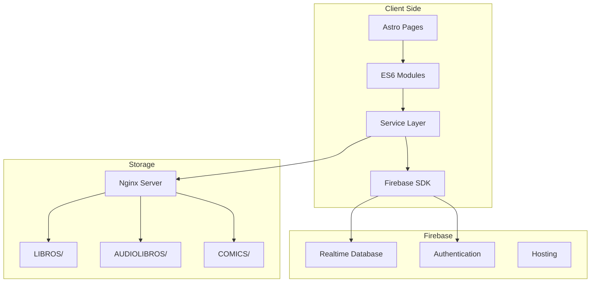
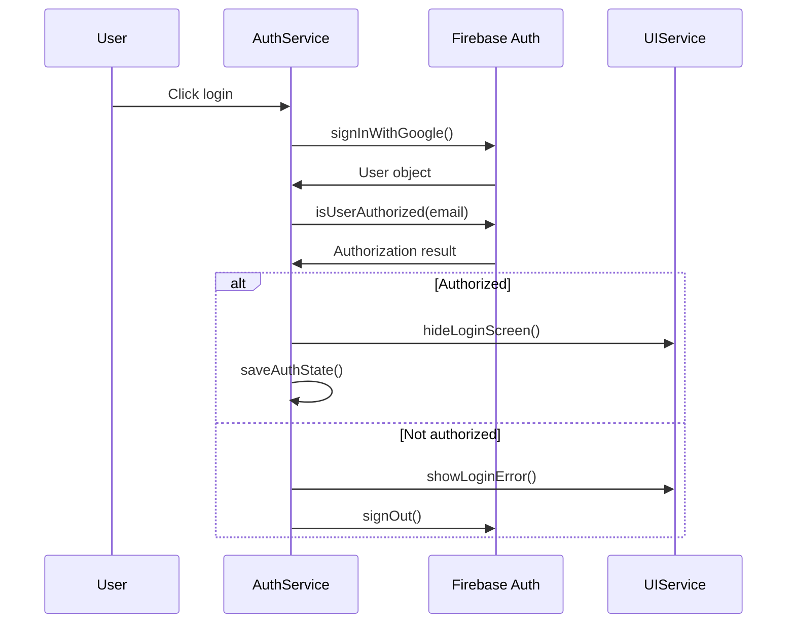
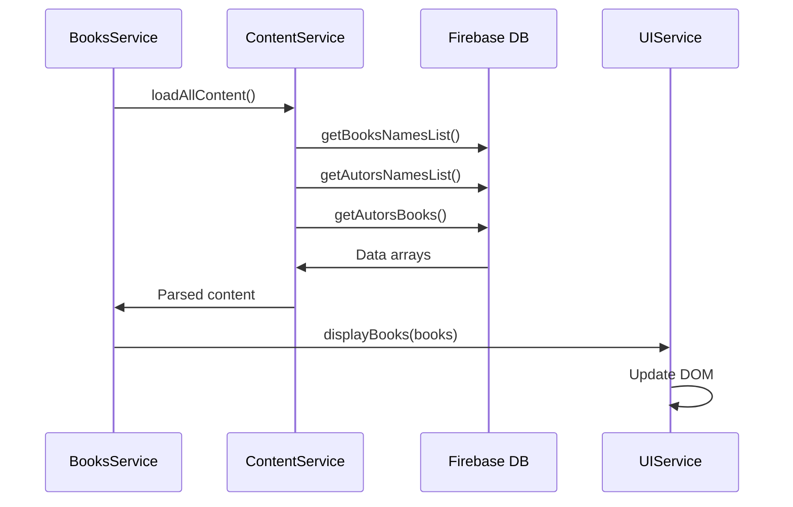
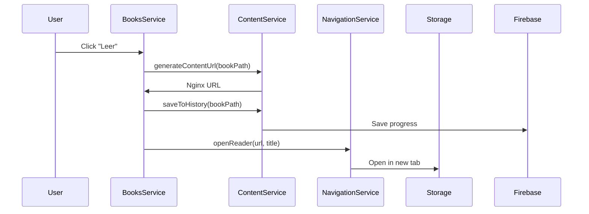

# LecturAPP - Arquitectura del Sistema 🏗️

## Índice
- [Visión General](#visión-general)
- [Principios de Diseño](#principios-de-diseño)
- [Arquitectura Frontend](#arquitectura-frontend)
- [Arquitectura Backend](#arquitectura-backend)
- [Flujo de Datos](#flujo-de-datos)
- [Seguridad](#seguridad)
- [Performance](#performance)
- [Patrones de Diseño](#patrones-de-diseño)
- [Escalabilidad](#escalabilidad)

## Visión General

LecturAPP está construida como una **Single Page Application (SPA) modular** usando Astro como Static Site Generator con páginas independientes para cada tipo de contenido. La arquitectura sigue principios SOLID y clean code, con una clara separación de responsabilidades.

### Stack Tecnológico
```
Frontend:  Astro 5.13.0 + ES6 Modules + Pico CSS
Backend:   Firebase (Realtime DB + Auth + Hosting)
Storage:   Nginx Static Server (Europa)
Readers:   EPUB.js + HTML5 Audio + JSZip
```

### Arquitectura de Alto Nivel


## Principios de Diseño

### 1. **SOLID Principles**

#### Single Responsibility Principle (SRP)
```javascript
// ✅ Cada servicio tiene una responsabilidad única
export class AuthService {
  // Solo maneja autenticación
}

export class ContentService {
  // Solo maneja contenido
}

export class ThemeService {
  // Solo maneja temas
}
```

#### Open/Closed Principle (OCP)
```javascript
// ✅ Extensible sin modificar código existente
export class ContentService {
  async loadContent(type) {
    // Puede extenderse para nuevos tipos
    return this.getContentByType(type);
  }
  
  getContentByType(type) {
    // Fácil agregar nuevos tipos
    switch (type) {
      case 'books': return this.books;
      case 'audiobooks': return this.audiobooks;
      case 'comics': return this.comics;
      // Nuevos tipos aquí...
    }
  }
}
```

#### Dependency Inversion Principle (DIP)
```javascript
// ✅ Servicios dependen de abstracciones
class BooksApp {
  constructor() {
    // Inyección de dependencias
    this.authService = authService;
    this.contentService = contentService;
    this.uiService = uiService;
  }
}
```

### 2. **Clean Code Principles**

- **Nombres descriptivos**: `getUserReadingHistory()` vs `getData()`
- **Funciones pequeñas**: Una función, una responsabilidad
- **Evitar comentarios**: El código se autodocumenta
- **Manejo consistente de errores**: try/catch centralizado

### 3. **Modularidad**

```
public/js/modules/
├── auth.js           # Autenticación
├── content.js        # Gestión de contenido  
├── theme.js          # Temas light/dark
├── ui.js             # Operaciones de UI
├── navigation.js     # Navegación entre páginas
└── books.js          # Funcionalidad específica de libros
```

## Arquitectura Frontend

### Estructura de Páginas
```
src/pages/
├── index.astro       # Landing + Auth + Menu
├── books.astro       # Biblioteca EPUB
├── audiobooks.astro  # Biblioteca MP3
└── comics.astro      # Biblioteca CBZ/CBR
```

### Patrón de Aplicación por Página
Cada página sigue el mismo patrón:

```javascript
// Ejemplo: books-refactored.js
class BooksApp {
  async init() {
    await this.initializeServices();
    this.setupAuthentication();
    this.setupEventListeners();
  }
  
  async initializeServices() {
    // Inicializar servicios necesarios
  }
  
  setupAuthentication() {
    // Manejar estado de autenticación
  }
  
  setupEventListeners() {
    // Configurar eventos específicos de la página
  }
}
```

### Sistema de Servicios

#### AuthService
- **Responsabilidad**: Gestión completa de autenticación
- **Funciones clave**: Login, logout, estado de sesión
- **Patrón**: Singleton con callbacks

```javascript
export class AuthService {
  constructor() {
    this.currentUser = null;
    this.authStateCallbacks = [];
  }
  
  onAuthStateChange(callback) {
    this.authStateCallbacks.push(callback);
  }
}
```

#### ContentService  
- **Responsabilidad**: Carga y gestión de contenido multimedia
- **Funciones clave**: CRUD de libros/audios/cómics
- **Patrón**: Repository pattern

```javascript
export class ContentService {
  async loadAllContent() {
    const [books, audiobooks, comics] = await Promise.all([
      this.loadBooks(),
      this.loadAudiobooks(), 
      this.loadComics()
    ]);
  }
}
```

#### UIService
- **Responsabilidad**: Manipulación del DOM y estados visuales
- **Funciones clave**: Show/hide, loading states, modales
- **Patrón**: Utility class

#### ThemeService
- **Responsabilidad**: Gestión de temas claro/oscuro
- **Funciones clave**: Toggle theme, persistencia localStorage
- **Patrón**: Singleton

#### NavigationService
- **Responsabilidad**: Navegación entre páginas
- **Funciones clave**: Routing, deep linking, breadcrumbs
- **Patrón**: Command pattern

### Gestión de Estado

#### Estado de Autenticación
```javascript
// Persistido en localStorage
{
  "lectur-app-auth-state": "authenticated"
}

// Estado en memoria
{
  currentUser: User | null,
  isAuthenticated: boolean
}
```

#### Estado de Contenido
```javascript
// En memoria (ContentService)
{
  books: string[],
  audiobooks: string[],
  comics: string[],
  authors: string[],
  authorBooks: { [author: string]: string[] }
}
```

#### Estado de UI
```javascript
// En memoria + DOM state
{
  currentTheme: 'light' | 'dark',
  currentPage: 'home' | 'books' | 'audiobooks' | 'comics',
  isLoading: boolean,
  activeModal: string | null
}
```

## Arquitectura Backend

### Firebase Realtime Database

#### Estructura de Datos
```json
{
  "libros": {
    "0": "libro1.epub",
    "1": "libro2.epub"
  },
  "audiolibros": {
    "0": "audio1.mp3", 
    "1": "audio2.mp3"
  },
  "comics": {
    "0": "comic1.cbz",
    "1": "comic2.cbr"
  },
  "autores": {
    "0": "Autor 1",
    "1": "Autor 2"
  },
  "librosPorAutor": {
    "Autor_1": {
      "libro_123": "libro1.epub"
    }
  },
  "usuariosAutorizados": {
    "email|domain|com": true
  },
  "historialLectura": {
    "user_hash": {
      "content_hash": {
        "bookPath": "path/to/book.epub",
        "title": "Title",
        "author": "Author",
        "currentChapter": 5,
        "totalChapters": 10,
        "progress": 50,
        "currentTime": 1234, // Para audios
        "duration": 3600,    // Para audios
        "lastRead": "2024-01-01T00:00:00.000Z",
        "type": "book|audiobook|comic"
      }
    }
  }
}
```

#### Reglas de Seguridad
```javascript
// database.rules.json
{
  "rules": {
    ".read": "auth != null && auth.token.email != null",
    ".write": "auth != null && auth.token.email != null",
    "historialLectura": {
      "$userId": {
        ".read": "$userId === auth.uid",
        ".write": "$userId === auth.uid"
      }
    }
  }
}
```

### Sistema de Storage

#### Nginx Static Server
```
https://storage.lecturapp.es/
├── LIBROS/           # 126,259 EPUB files
│   ├── libro1.epub
│   └── libro2.epub
├── AUDIOLIBROS/      # 6,121 MP3 files
│   ├── audio1.mp3
│   └── audio2.mp3
└── COMICS/           # CBZ/CBR files
    ├── comic1.cbz
    └── comic2.cbr
```

#### URL Generation Pattern
```javascript
// ContentService.generateContentUrl()
const baseUrl = 'https://storage.lecturapp.es';
const directory = {
  'books': 'LIBROS',
  'audiobooks': 'AUDIOLIBROS', 
  'comics': 'COMICS'
}[contentType];

return `${baseUrl}/${directory}/${encodeURIComponent(filename)}`;
```

## Flujo de Datos

### 1. Flujo de Autenticación


### 2. Flujo de Carga de Contenido


### 3. Flujo de Lectura de Contenido


## Seguridad

### 1. Autenticación
- **OAuth 2.0** con Google
- **JWT tokens** gestionados por Firebase
- **Whitelist** de emails autorizados

### 2. Autorización
```javascript
// Verificación en cada carga de página
auth.onAuthStateChanged(async (user) => {
  if (user) {
    const isAuthorized = await isUserAuthorized(user.email);
    if (!isAuthorized) {
      await signOut();
      redirect('/');
    }
  }
});
```

### 3. Protección de Datos
- **HTTPS only** en todas las conexiones
- **CORS** configurado específicamente
- **Database rules** restrictivas por usuario
- **No secrets** en código frontend

### 4. Validación de Entrada
```javascript
// Sanitización de nombres de archivo
const cleanTitle = title
  .replace(/_/g, ' ')
  .replace(/[^a-zA-Z0-9-_\s]/g, '')
  .trim();
```

## Performance

### 1. Frontend Optimizations

#### Lazy Loading
```javascript
// Carga diferida de módulos
const { BooksService } = await import('./modules/books.js');
```

#### Efficient DOM Operations
```javascript
// Batch DOM updates
const fragment = document.createDocumentFragment();
books.forEach(book => {
  fragment.appendChild(createBookElement(book));
});
container.appendChild(fragment);
```

#### Local Storage Caching
```javascript
// Cache de estado de autenticación
localStorage.setItem('lectur-app-auth-state', 'authenticated');
localStorage.setItem('lectur-app-theme', 'dark');
```

### 2. Backend Optimizations

#### Firebase Optimizations
```javascript
// Carga paralela de datos
const [books, audiobooks, authors] = await Promise.all([
  getBooksNamesList(),
  getAudiobooksList(), 
  getAutorsNamesList()
]);
```

#### Content Delivery
- **Nginx static server** para archivos multimedia
- **HTTP/2** enabled
- **Gzip compression** para archivos de texto
- **Browser caching** headers configurados

### 3. Métricas de Performance

#### Core Web Vitals Targets
- **LCP (Largest Contentful Paint)**: < 2.5s
- **FID (First Input Delay)**: < 100ms  
- **CLS (Cumulative Layout Shift)**: < 0.1

#### Bundle Size
- **Total JS bundle**: ~150KB gzipped
- **CSS bundle**: ~20KB gzipped
- **Critical path**: Login → Menu → Content list

## Patrones de Diseño

### 1. Singleton Pattern
```javascript
// Un solo instancia de cada servicio
export const authService = new AuthService();
export const contentService = new ContentService();
export const themeService = new ThemeService();
```

### 2. Observer Pattern
```javascript
// AuthService notifica cambios de estado
export class AuthService {
  onAuthStateChange(callback) {
    this.authStateCallbacks.push(callback);
  }
  
  notifyAuthStateChange(user) {
    this.authStateCallbacks.forEach(callback => callback(user));
  }
}
```

### 3. Factory Pattern
```javascript
// ContentService crea URLs específicas por tipo
generateContentUrl(path, type) {
  const factories = {
    'books': () => `${baseUrl}/LIBROS/${path}`,
    'audiobooks': () => `${baseUrl}/AUDIOLIBROS/${path}`,
    'comics': () => `${baseUrl}/COMICS/${path}`
  };
  
  return factories[type]();
}
```

### 4. Module Pattern
```javascript
// Encapsulación y exportación controlada
export class UIService {
  // Métodos privados
  #createElement(tag, classes) { /* ... */ }
  
  // API pública
  showModal(id) { /* ... */ }
  hideModal(id) { /* ... */ }
}
```

### 5. Command Pattern
```javascript
// NavigationService encapsula navegación
export class NavigationService {
  goToBooks() { window.location.href = '/books'; }
  goToAudiobooks() { window.location.href = '/audiobooks'; }
  goToComics() { window.location.href = '/comics'; }
}
```

## Escalabilidad

### 1. Escalabilidad Horizontal

#### Content Distribution
```
Storage Layer:
┌─────────────┐    ┌─────────────┐    ┌─────────────┐
│  Primary    │    │  Mirror 1   │    │  Mirror 2   │
│  (Europa)   │    │  (US-East)  │    │  (Asia)     │
└─────────────┘    └─────────────┘    └─────────────┘
```

#### Database Sharding
```javascript
// Potencial sharding por tipo de contenido
const databases = {
  books: 'lectur-app-books',
  audiobooks: 'lectur-app-audio', 
  comics: 'lectur-app-comics'
};
```

### 2. Escalabilidad de Características

#### Plugin Architecture
```javascript
// Sistema de plugins para nuevos tipos de contenido
class ContentPlugin {
  constructor(type, reader, loader) {
    this.type = type;
    this.reader = reader;
    this.loader = loader;
  }
}

// Registro de plugins
contentService.registerPlugin(
  new ContentPlugin('magazines', MagazineReader, MagazineLoader)
);
```

#### Feature Flags
```javascript
// Control de características por ambiente
const features = {
  audiobooks: import.meta.env.ENABLE_AUDIOBOOKS,
  comics: import.meta.env.ENABLE_COMICS,
  advanced_search: import.meta.env.ENABLE_ADVANCED_SEARCH
};
```

### 3. Monitoreo y Métricas

#### Performance Monitoring
```javascript
// Web Vitals tracking
import { getCLS, getFID, getFCP, getLCP, getTTFB } from 'web-vitals';

getCLS(console.log);
getFID(console.log);
getLCP(console.log);
```

#### Error Tracking
```javascript
// Global error handler
window.addEventListener('error', (event) => {
  console.error('Global error:', event.error);
  // Send to monitoring service
});
```

#### Usage Analytics
```javascript
// Content consumption tracking
contentService.onContentAccess((type, path) => {
  analytics.track('content_accessed', { type, path });
});
```

---

## Conclusión

La arquitectura de LecturAPP está diseñada para ser:

- **Mantenible**: Código modular con responsabilidades claras
- **Escalable**: Patrones que permiten crecimiento horizontal y vertical  
- **Performante**: Optimizaciones en frontend y backend
- **Segura**: Autenticación robusta y protección de datos
- **Extensible**: Fácil adición de nuevos tipos de contenido

Esta documentación debe actualizarse conforme evolucione el sistema.

---

**Versión**: 1.0  
**Última actualización**: Agosto 2025  
**Responsable**: Equipo de desarrollo LecturAPP